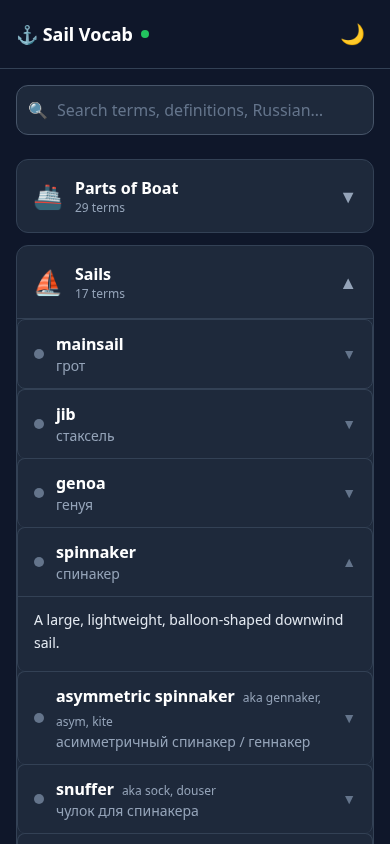
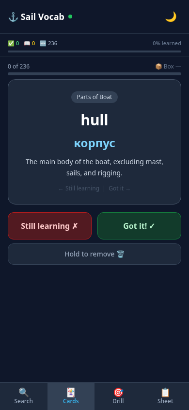
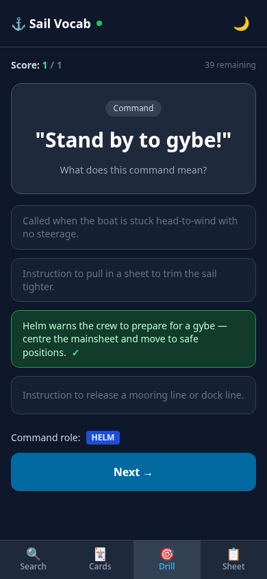
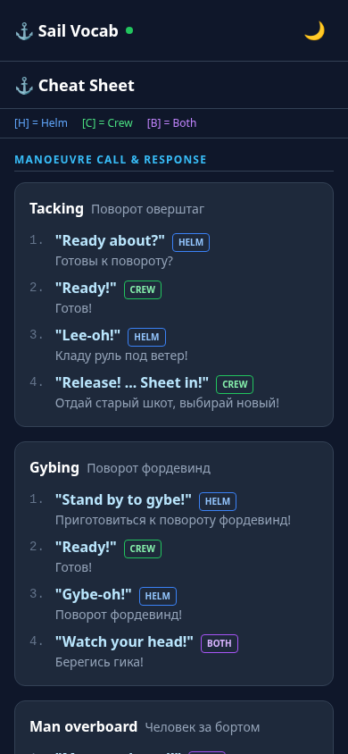

# ⚓ Sailing Vocab — RU→EN Trainer

A pocket-sized app for learning **British sailing English** from Russian. It's
built for one job: help a Russian-native skipper give clear, correct commands to
a British crew — and it works **completely offline**, so it keeps working out on
the water with no signal.

Open it once with internet, and from then on every word, definition, and
manoeuvre sequence lives on your phone. No account, no sign-up, no network.

> **Boat context:** the vocabulary is tuned for a *Marée Haute* Django 9.80 —
> lifting keel, bowsprit with asymmetric spinnaker/gennaker, tiller, and a
> Yanmar 20 hp saildrive diesel. British terms are primary; US variants are
> marked `aka`.

## What you can do

The app has four tabs along the bottom. Tap between them any time.

| | Tab | What it's for |
|---|---|---|
| 🔍 | **Search** | Browse or search 230+ terms by category. Tap any word to see its Russian meaning and a real on-deck example. |
| 🃏 | **Cards** | Flashcards that space themselves out (Leitner boxes) so you review weak words more often. Flip to see the answer, then mark *Got it* or *Still learning*. |
| 🎯 | **Drill** | Quick multiple-choice quiz on the command terms — the fast way to test yourself. |
| 📋 | **Sheet** | A printable cheat sheet of manoeuvre **call → response** sequences (tacking, gybing, MOB, mooring, reefing…) plus a command reference. |

### 🔍 Search

Type in the box to filter across the English term, its definition, and the
Russian meaning, or tap a category to expand it. Tap a word to reveal its
meaning and an example of how it's actually used on deck.



### 🃏 Cards

Read the English word, guess, then tap **Reveal** to check the definition and
Russian meaning. Mark **Got it!** or **Still learning** — the app schedules each
card so the ones you miss come back sooner. A 🔊 button appears when your phone
has an English voice available offline. Hold a card to remove it from the deck.



### 🎯 Drill

Answer the multiple-choice question. The correct answer highlights in green and
shows its meaning, so you learn even when you miss one.



### 📋 Sheet

The manoeuvre cheat sheet: each command shows who says it — **[H]** helm,
**[C]** crew, **[B]** both — with the English call and the Russian translation.
Print it or keep it open at the helm.



## Install it on your phone

It's a **Progressive Web App**, so it installs like a native app but from the
browser — no App Store needed.

1. Open the app's URL in **Safari** (iPhone) or **Chrome** (Android) while you
   still have internet.
2. Let it finish loading once.
3. Tap **Share → Add to Home Screen** (iOS) or the **⋮ menu → Install app**
   (Android).
4. Launch it from the new icon. It now runs full-screen and works with the
   network switched off — perfect for the boat.

## A note on the 🔊 speak button

Speech is a nice-to-have, not a requirement. Phones don't always ship with an
offline English voice, so the app only shows the 🔊 button when a usable voice
is actually available. The written English term, definition, Russian meaning,
and example are always there on their own.

---

## For developers

<details>
<summary>Build, run, and offline-verification details</summary>

### Development

```bash
bun install --frozen-lockfile
bun run dev         # dev server
bun run lint        # oxlint
bun run typecheck   # tsc -b
bun run build       # tsc -b && vite build  → dist/
bun run check       # data-contract validation (scripts/check-vocab.ts)
bun run preview     # serve the production dist/ locally
```

### How offline works

After the first load, everything is served from the service-worker precache —
the full vocabulary and manoeuvre sequences are **inlined into the JS bundle**,
so there is **no `fetch`/XHR of vocab data** and no network call is needed after
first load.

**Static check** (automatic in the build) — after `bun run build`:

- `dist/sw.js` and `dist/workbox-*.js` are emitted.
- The precache manifest inside `dist/sw.js` lists `index.html` and the main
  `assets/index-*.js` chunk.
- Grep `dist/assets/*.js` for a known term such as `halyard` or `mainsheet` —
  both are present, confirming the vocab is inlined.

**Manual on-device check** (do this before the trip) — no headless browser runs
in CI, so verify the live offline behaviour by hand:

1. `bun run build && bun run preview` — note the localhost URL it prints.
2. Open it in Chrome. In DevTools → **Application → Service Workers**, confirm a
   worker is **activated** (reload once if still "installing"). Under
   **Application → Cache Storage**, confirm a `workbox-precache-*` cache holds
   `index.html` and the `assets/index-*.js` chunk.
3. In the **Network** tab, tick **Offline** (or turn off the OS network).
4. **Reload the page** — it must load fully from cache.
5. Confirm all four tabs work offline: Search (query + expand a term), Cards
   (Reveal shows definition/Russian), Drill (answer highlights), Sheet
   (sequences render). 🔊 may be absent — that's expected.
6. Install to the home screen and repeat steps 3–5 launched from the icon, fully
   offline, to confirm the standalone PWA works with no network.

### Auto-merge

PRs squash-merge themselves once their **CI** run passes
(`.github/workflows/automerge.yml`). To hold a PR open, mark it a **draft** or
add the **`no-automerge`** label.

</details>
